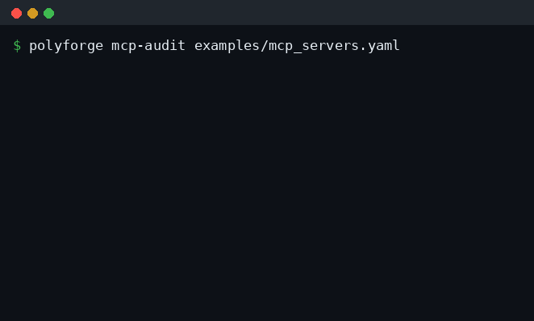

# PolyForge — MCP Server Reliability Auditor + Fallback

**Half the public MCP servers are abandoned. Don't let a dead one silently
corrupt your agent.**

When an AI agent calls a broken or drifted MCP tool, the model often doesn't
crash — it improvises around the bad response and keeps going, contaminating
every downstream step with no error and no alert. PolyForge catches that *before*
it ships: it scores every MCP server your agent depends on, flags the dead ones,
and routes around them.

## Quick start (no credentials needed)

```bash
git clone https://github.com/AryanGonsalves/polyforge.git
cd polyforge
pip install -e .

# Audit the MCP servers your agent depends on
polyforge mcp-audit examples/mcp_servers.yaml

# See audit + fallback routing end to end
python -m examples.mcp_demo
```

> **Note:** PolyForge isn't on PyPI yet, so install from source as shown above.
> PyPI publishing is planned — once it's live, `pip install polyforge` will work
> directly.

Example output:



<!-- Static fallback for anyone who can't see the animation above -->

```
  PRODUCTION  mcp-server-postgres  (8/9)
       LIGHT  mcp-weather-community  (6/9)   - last commit 70 days ago (>45)
        DEAD  mcp-scraper-solo  (0/9)
               - single contributor (high abandonment risk)
               - CI not passing
               - unpatched CVE present
```

## What it does

| Capability | What it does | Where |
|-----------|--------------|-------|
| Reliability scoring | 9-point rubric per server → production / light / dead | `mcp/scorer.py` |
| Audit | Bucket all your servers; fail CI if any are dead | `mcp/auditor.py` |
| Fallback routing | Resolve a capability to the healthiest server, skip dead ones | `mcp/auditor.py` |

The scoring signals: commit recency, contributor count (a sole maintainer is
the highest-signal abandonment indicator), CI status, unpatched CVEs, clean
install, hosted uptime, and schema stability. Unknown signals are treated
conservatively — unknown is never given credit.

## Auto-gather signals from GitHub

Instead of hand-writing every signal, PolyForge can fetch the cheap, high-signal
ones — last commit date, contributor count, and CI status — straight from a
repo on GitHub:

```bash
# Score a single server straight from its repo
polyforge mcp-gather owner/repo

# Audit a whole manifest, enriching any entry that declares a `repo:`
polyforge mcp-audit examples/mcp_servers_gather.yaml --gather
```

Gathered signals are merged *over* the YAML (live data wins; the YAML still
supplies what GitHub can't — CVE status, clean install, hosted uptime, schema
stability). Because unknown signals get no credit, the three auto-gathered
signals alone won't reach a passing score — pair them with a YAML entry. Set
`GITHUB_TOKEN` (or pass `--token`) to avoid API rate limits. If a repo can't be
fetched, that entry falls back to its YAML signals with a warning rather than
failing the whole audit.

## Library use

Install from source first (see Quick start above); PyPI publishing is planned,
after which `pip install polyforge` will work directly.

```python
from datetime import date
from polyforge.mcp.scorer import ServerSignals
from polyforge.mcp.auditor import audit, FallbackRouter

servers = [
    ServerSignals("postgres-mcp", last_commit=date(2026, 5, 25),
                  contributor_count=12, ci_passing=True),
    ServerSignals("scraper-solo", last_commit=date(2025, 10, 1),
                  contributor_count=1, ci_passing=False),
]

report = audit(servers)
print("dead:", [r.name for r in report.dead])

router = FallbackRouter(servers)
chosen = router.resolve(["scraper-solo", "postgres-mcp"])  # skips dead, picks healthy
```

## Why this and not an LLM gateway

The LLM-gateway space (routing/fallback across model providers) is mature and
crowded — LiteLLM, Portkey, OpenRouter all do it well. MCP *server* reliability
is the same fallback principle applied one layer out, to tools, where the
problem is fresh and teams are still scoring servers by hand. PolyForge reuses
the gateway's registry/status/fallback pattern there.

> The model-gateway pieces (`gateway/`, `adapters/`) still ship and work — they
> were the origin of the fallback pattern this is built on. The MCP auditor is
> the focus.

## Honest limits (current phase)

- Commit recency, contributor count, and CI status can be auto-gathered from
  GitHub (`mcp-gather` / `mcp-audit --gather`); the remaining signals (CVE, clean
  install, uptime, schema stability) are still supplied via YAML. Gathering is
  kept separate from scoring, so the scorer stays deterministic and testable.
- The rubric weights are a sensible default, not yet validated against a large
  labeled set of real servers.
- Fallback routing resolves the best server; it does not yet execute MCP calls.

## Validation status

This targets a real, documented pain (silent MCP tool failures; >50% of public
servers abandoned per a 2026 audit), but the *product-market fit is a hypothesis,
not proven*. Next step is putting `mcp-audit` in front of real agent developers
before building further.

## Roadmap

1. **Now:** scorer, auditor, fallback router, CLI, manifest ✔
2. **Done:** auto-gather commit recency, contributors & CI from GitHub
   (`mcp-gather`, `mcp-audit --gather`) ✔ — auto-gathering CVE/uptime/schema is future work
3. GitHub Action: fail a PR that wires in a dead MCP server
4. Live MCP call execution through the fallback router
5. Hosted registry of community-scored servers
